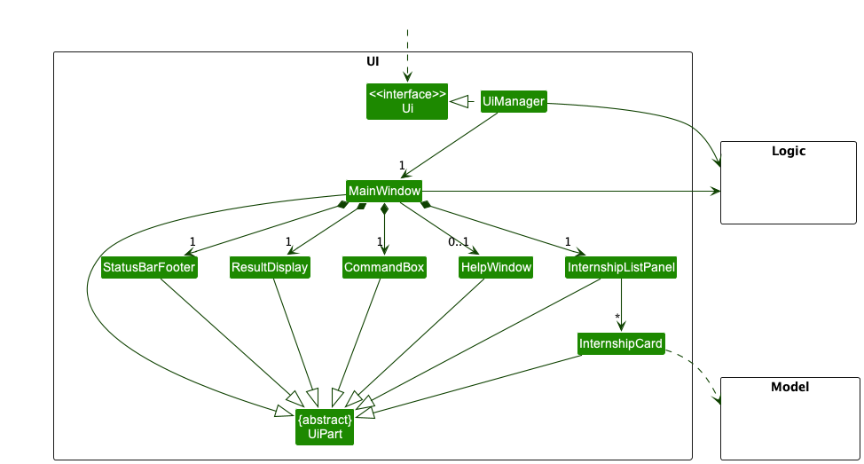
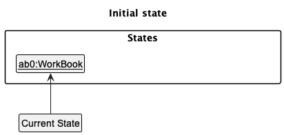
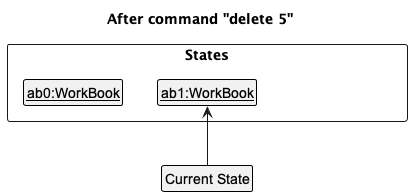
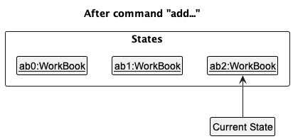
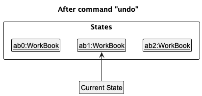
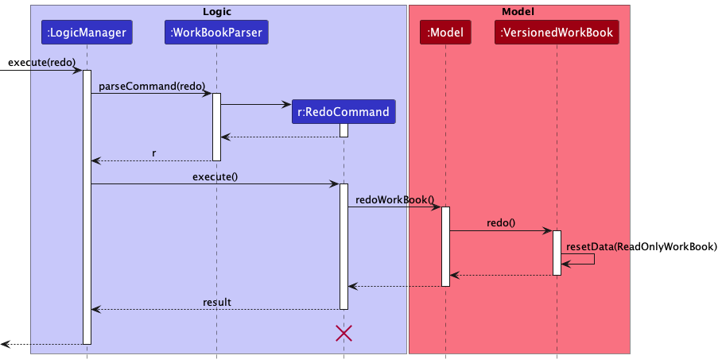
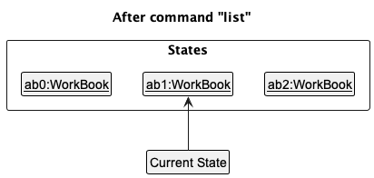
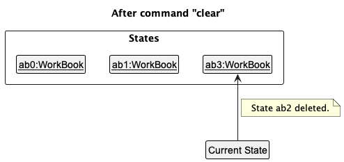

* Table of Contents
{:toc}

--------------------------------------------------------------------------------------------------------------------

## **Acknowledgements**

* Libraries used: [JavaFX](https://openjfx.io), [Jackson](https://github.com/FasterXML/jackson), [JUnit5](https://github.com/junit-team/junit5).  
* This project is based on the AddressBook-Level3 project created by the [SE-EDU initiative](https://se-education.org).

--------------------------------------------------------------------------------------------------------------------

## **Setting up, getting started**

Refer to the guide [_Setting up and getting started_](SettingUp.md).

--------------------------------------------------------------------------------------------------------------------

## **Design**

:bulb: **Tip:** The `.puml` files used to create diagrams in this document can be found in the [diagrams](https://github.com/se-edu/addressbook-level3/tree/master/docs/diagrams/) folder. Refer to the [_PlantUML Tutorial_ at se-edu/guides](https://se-education.org/guides/tutorials/plantUml.html) to learn how to create and edit diagrams.

### Architecture

The ***Architecture Diagram*** given above explains the high-level design of the App.

Given below is a quick overview of main components and how they interact with each other.

**Main components of the architecture**

**`Main`** has two classes called [`Main`](https://github.com/se-edu/addressbook-level3/tree/master/src/main/java/seedu/address/Main.java) and [`MainApp`](https://github.com/se-edu/addressbook-level3/tree/master/src/main/java/seedu/address/MainApp.java). It is responsible for,
* At app launch: Initializes the components in the correct sequence, and connects them up with each other.
* At shut down: Shuts down the components and invokes cleanup methods where necessary.

[**`Commons`**](#common-classes) represents a collection of classes used by multiple other components.

The rest of the App consists of four components.

* [**`UI`**](#ui-component): The UI of the App.
* [**`Logic`**](#logic-component): The command executor.
* [**`Model`**](#model-component): Holds the data of the App in memory.
* [**`Storage`**](#storage-component): Reads data from, and writes data to, the hard disk.

**How the architecture components interact with each other**

The *Sequence Diagram* below shows how the components interact with each other for the scenario where the user issues the command `delete 1`.

Each of the four main components (also shown in the diagram above),

* defines its *API* in an `interface` with the same name as the Component.
* implements its functionality using a concrete `{Component Name}Manager` class (which follows the corresponding API `interface` mentioned in the previous point.

For example, the `Logic` component defines its API in the `Logic.java` interface and implements its functionality using the `LogicManager.java` class which follows the `Logic` interface. Other components interact with a given component through its interface rather than the concrete class (reason: to prevent outside component's being coupled to the implementation of a component), as illustrated in the (partial) class diagram below.

The sections below give more details of each component.

### UI component

The **API** of this component is specified in [`Ui.java`](https://github.com/se-edu/addressbook-level3/tree/master/src/main/java/seedu/address/ui/Ui.java)

The UI consists of a `MainWindow` that is made up of parts e.g.`CommandBox`, `ResultDisplay`, `InternshipListPanel`, `StatusBarFooter` etc. All these, including the `MainWindow`, inherit from the abstract `UiPart` class which captures the commonalities between classes that represent parts of the visible GUI.

The `UI` component uses the JavaFx UI framework. The layout of these UI parts are defined in matching `.fxml` files that are in the `src/main/resources/view` folder. For example, the layout of the [`MainWindow`](https://github.com/se-edu/addressbook-level3/tree/master/src/main/java/seedu/address/ui/MainWindow.java) is specified in [`MainWindow.fxml`](https://github.com/se-edu/addressbook-level3/tree/master/src/main/resources/view/MainWindow.fxml)

The `UI` component,

* executes user commands using the `Logic` component.
* listens for changes to `Model` data so that the UI can be updated with the modified data.
* keeps a reference to the `Logic` component, because the `UI` relies on the `Logic` to execute commands.
* depends on some classes in the `Model` component, as it displays `Internship` object residing in the `Model`.

### Logic component

**API** : [`Logic.java`](https://github.com/se-edu/addressbook-level3/tree/master/src/main/java/seedu/address/logic/Logic.java)

Here's a (partial) class diagram of the `Logic` component:

How the `Logic` component works:
1. When `Logic` is called upon to execute a command, it uses the `WorkBookParser` class to parse the user command.
1. This results in a `Command` object (more precisely, an object of one of its subclasses e.g., `AddCommand`) which is executed by the `LogicManager`.
1. The command can communicate with the `Model` when it is executed (e.g. to add an internship).
1. The result of the command execution is encapsulated as a `CommandResult` object which is returned back from `Logic`.

The Sequence Diagram below illustrates the interactions within the `Logic` component for the `execute("delete 1")` API call.

:information_source: **Note:** The lifeline for `DeleteCommandParser` should end at the destroy marker (X) but due to a limitation of PlantUML, the lifeline reaches the end of diagram.

Here are the other classes in `Logic` (omitted from the class diagram above) that are used for parsing a user command:

How the parsing works:
* When called upon to parse a user command, the `WorkBookParser` class creates an `XYZCommandParser` (`XYZ` is a placeholder for the specific command name e.g., `AddCommandParser`) which uses the other classes shown above to parse the user command and create a `XYZCommand` object (e.g., `AddCommand`) which the `WorkBookParser` returns back as a `Command` object.
* All `XYZCommandParser` classes (e.g., `AddCommandParser`, `DeleteCommandParser`, ...) inherit from the `Parser` interface so that they can be treated similarly where possible e.g, during testing.

### Model component
**API** : [`Model.java`](https://github.com/se-edu/addressbook-level3/tree/master/src/main/java/seedu/address/model/Model.java)

The `Model` component,

* stores the work book data i.e., all `Internship` objects (which are contained in a `UniqueInternshipList` object).
* stores the currently 'selected' `Internship` objects (e.g., results of a search query) as a separate _filtered_ list which is exposed to outsiders as an unmodifiable `ObservableList<Internship>` that can be 'observed' e.g. the UI can be bound to this list so that the UI automatically updates when the data in the list change.
* stores a `UserPref` object that represents the user’s preferences. This is exposed to the outside as a `ReadOnlyUserPref` objects.
* does not depend on any of the other three components (as the `Model` represents data entities of the domain, they should make sense on their own without depending on other components)

:information_source: **Note:** An alternative (arguably, a more OOP) model is given below. It has a `Tag` list in the `WorkBook`, which `Internship` references. This allows `WorkBook` to only require one `Tag` object per unique tag, instead of each `Internship` needing their own `Tag` objects. 

### Storage component

**API** : [`Storage.java`](https://github.com/se-edu/addressbook-level3/tree/master/src/main/java/seedu/address/storage/Storage.java)

The `Storage` component,
* can save both work book data and user preference data in json format, and read them back into corresponding objects.
* inherits from both `WorkBookStorage` and `UserPrefStorage`, which means it can be treated as either one (if only the functionality of only one is needed).
* depends on some classes in the `Model` component (because the `Storage` component's job is to save/retrieve objects that belong to the `Model`)

### Common classes

Classes used by multiple components are in the `seedu.workbook.commons` package.

--------------------------------------------------------------------------------------------------------------------

## **Implementation**

This section describes some noteworthy details on how certain features are implemented.

### Add feature

#### Implementation

The add feature is facilitated by `AddCommand` and `AddCommandParser` classes. The `parse` method in `AddCommandParser`
checks if mandatory fields are first present. 
If all are present, the new `Internship` will be added to the `UniqueInternshipList` in a sorted-by-date order.

Below shows the class diagram of adding a new internship application into the list which automatically sorts using `SortedList`.
This takes place in the `UniqueInternshipList` as shown in the diagram below.
Some `logic` and `model` details are omitted as they are already explained in the [Architecture section](#architecture) above.

#### Design considerations:

**Aspect: `Stage` field:**

* **Alternative 1 (current choice):** Not restricting to enums, (proposed: warn if input does not match general stages)
    * Pros: Flexibility for user by allowing unique stages from different companies which we did not prepare for to be added.
    * Cons: Will not have stage-specific tips that have been gathered for more general interview stages.

* **Alternative 2:** Restricting to enums
    * Pros: Prevent the need for user to edit previous command in the event of a typo,
    * Cons: Flexibility is heavily restricted, user may encounter stages that we may not have prepared for, which may annoy the user if the user is not allowed to add the stage into the internship tracker.

**Aspect: `DateTime` field:**

* **Alternative 1 (current choice):** Not modularizing Time and Date
    * Pros: Most stages have a date and time associated with it. Making one of the two optional takes extra effort for something that uncommon. Can be left to later stages of development.
    * Cons: May not be prepared for stages without date and/or time, therefore not making the tracker flexible enough.

* **Alternative 2:** Modularizing Time and Date
    * Pros: Some stages that we may not have prepared for may omit date or time, encouraging flexibility of the tracker.
    * Cons: Effort required is too high in the early stages of development whereby a functional product is prioritized.

### Undo/Redo feature

The undo feature allows for users to revert back to their previous undone state in the Workbook. 
The redo feature complements the undo feature by allowing users to restore to its previous changed state following an undo command. 

#### Implementation

The undo/redo mechanism is facilitated by `VersionedWorkBook`. It extends `WorkBook` with an undo/redo history, stored internally as an `workBookStateList` and `currentStatePointer`. Additionally, it implements the following operations:

* `VersionedWorkBook#commit()` — Saves the current work book state in its history.
* `VersionedWorkBook#undo()` — Restores the previous work book state from its history.
* `VersionedWorkBook#redo()` — Restores a previously undone work book state from its history.

These operations are exposed in the `Model` interface as `Model#commitWorkBook()`, `Model#undoWorkBook()` and `Model#redoWorkBook()` respectively.

Given below is an example usage scenario and how the undo/redo mechanism behaves at each step.

Step 1. The user launches the application for the first time. The `VersionedWorkBook` will be initialized with the initial work book state, and the `currentStatePointer` pointing to that single work book state.

Step 2. The user executes `delete 5` command to delete the 5th internship in the work book. The `delete` command calls `Model#commitWorkBook()`, causing the modified state of the work book after the `delete 5` command executes to be saved in the `workBookStateList`, and the `currentStatePointer` is shifted to the newly inserted work book state.

Step 3. The user executes `add c/COMPANY …​` to add a new internship. The `add` command also calls `Model#commitWorkBook()`, causing another modified work book state to be saved into the `workBookStateList`.

:information_source: **Note:** If a command fails its execution, it will not call `Model#commitWorkBook()`, so the work book state will not be saved into the `workBookStateList`.

Step 4. The user now decides that adding the internship was a mistake, and decides to undo that action by executing the `undo` command. The `undo` command will call `Model#undoWorkBook()`, which will shift the `currentStatePointer` once to the left, pointing it to the previous work book state, and restores the work book to that state.

:information_source: **Note:** If the `currentStatePointer` is at index 0, pointing to the initial WorkBook state, then there are no previous WorkBook states to restore. The `undo` command uses `Model#canUndoWorkBook()` to check if this is the case. If so, it will return an error to the user rather
than attempting to perform the undo.

The following sequence diagram shows how the undo operation works:

:information_source: **Note:** The lifeline for `UndoCommand` should end at the destroy marker (X) but due to a limitation of PlantUML, the lifeline reaches the end of diagram.

Step 5. The user now decides that undoing the added internship was a mistake, and decides to redo that action by executing the `redo` command. The `redo` command will call `Model#redoWorkBook()`, which will shift the `currentStatePointer` once to the right, pointing it to the previous undone work book state, and restores the work book to that state.

:information_source: **Note:** If the `currentStatePointer` is at index `workBookStateList.size() - 1`, pointing to the latest work book state, then there are no undone WorkBook states to restore. The `redo` command uses `Model#canRedoWorkBook()` to check if this is the case. If so, it will return an error to the user rather than attempting to perform the redo.

The following sequence diagram shows how the redo operation works:

:information_source: **Note:** The lifeline for `RedoCommand` should end at the destroy marker (X) but due to a limitation of PlantUML, the lifeline reaches the end of diagram.

Step 6. The user then decides to execute the command `list`. Commands that do not modify the work book, such as `list`, will usually not call `Model#commitWorkBook()`, `Model#undoWorkBook()` or `Model#redoWorkBook()`. Thus, the `workBookStateList` remains unchanged.

Step 7. The user executes `clear`, which calls `Model#commitWorkBook()`. Since the `currentStatePointer` is not pointing at the end of the `workBookStateList`, all work book states after the `currentStatePointer` will be purged. Reason: It no longer makes sense to redo the `add c/COMPANY …​` command. This is the behavior that most modern desktop applications follow.

The following activity diagram summarizes what happens when a user executes a new command:

#### Design considerations:

**Aspect: How undo & redo executes:**

* **Alternative 1 (current choice):** Saves the entire work book.
  * Pros: Easy to implement.
  * Cons: May have performance issues in terms of memory usage.

* **Alternative 2:** Individual command knows how to undo/redo by
  itself.
  * Pros: Will use less memory (e.g. for `delete`, just save the internship being deleted).
  * Cons: We must ensure that the implementation of each individual command are correct.

### Tips feature

The tips feature shows curated tips for internship applications for specific application stages in order to help the user prepare for their certain deliverables, interviews and tests. The tips are currently only curated for common stages of internship applications due to the feasibility constraints.

#### Implementation

The tips feature is implemented in the `Model` component inside the `StageUtil` class. The list of supported stages is stored inside as a `List<Stage>`. The tips are stored in a `HashMap` that maps each `Stage` object to their respective `List<String>` of tips. The `getStageSpecificTips()` method will retrieve the list of tips for a supported stage as a `List<String>`. 

The tips are then stored and shown inside a `TipsCard` object that extends from `UiPart<Region>` and consists of one `Hbox` housing 2 `Hbox`s with each inner `Hbox` containing a `Label`. The first `Label` shows the index while the second `Label` shows the Tip itself.

The tips are show to the user in one of two ways depending on the UI layout.

##### Narrow UI implementation
In the narrow UI layout, the tips can be accessed through a `tipsButton` which has a light bulb icon on the `NarrowInternshipCard` which will open the `TipsWindow`. The `TipsWindow` is a member of every `NarrowInternshipCard` object and is created when the constructor is called. 

The light bulb button will only appear if the internship application is at a supported stage, The implementation of this is through the `hasNoTips()` method from the `Stage` class that returns a boolean `hasNoTips` depending on whether the stage of the application has tips.

If the application stage has tips and the button is pressed, the `TipsWindow` UI component of the `InternshipCard` will have its `GridPane` populated with `TipsCard` vertically after retrieving the tips using the `getStageSpecificTips()` method and building the `TipsCard` for each tip. The tips window is then opened.

If the application stage does not have tips, the tips button will be set to hidden and the `TipsWindow` will not be populated and will be inaccessible.

For more details on the UI implementation, please refer to the [Responsive UI](#responsive-ui-feature) section of the DG.

##### Wide UI implementation
In the wide UI layout, the tips are shown to the right of the internship list using the `TipsPanel` that extends `UiPart<Region>`. A listener is implemented in the `WideInternshipListPanel` to check which `NarrowInternshipCard` is currently selected.

If the internship card currently selected is at a supported stage, the `TipsPanel` will have its `GridPane` populated with `TipCard`s vertically after retrieving the tips using the `getStageSpecificStips()` method and building the `TipCard` for each tip.

If the internship card currently selected is not at a supported stage, the default `TipsPanel` will be shown which only has `Label` message telling the user that there are no tips for the stage yet.

For more detail on the UI implementation, please refer to the [Responsive UI](#responsive-ui-feature) section of the DG.

### Responsive UI feature

Workbook had two UI layouts depending on the size of the `MainWindow`. A narrow UI layout is shown when the window is resized narrower than the 1000 pixel breakpoint and a wide UI layout is shown when the window is resized wider than the 1000 pixel breakpoint. This is to improve readability and usability on narrow and wide screens.

#### Implementation

The implementation starts at the `MainWindow` class. The class has two UI layouts as members, the `WideInternshipListPanel` class and the `NarrowInternshipListPanel` class that both extend `UiPart<Region>`. The two UI layout objects are instantiated on calling the constructer of `MainWindow` and are populated with the internship applications on instantiation. This is to enable fast switching between the two layouts. 

The `setWidthEventHandlers()` listener will listen to the current window width. Whenever the window width passes the breakpoint, the `internshipListPanelPlaceholder` is cleared and populated with either the `WideInternshipListPanel` or the `NarrowInternshipListPanel` depending on the window width.

##### Narrow UI

The narrow UI layout uses the `NarrowInternshipListPanel` and populates its `ListView` with the `InternshipCard` that extends `UiPart<Region>`. It has a tips button that can open the tips window. Other than the tips button, the implementation is very similar to AB3 with minor styling changes.

For more details on the implementation of the tips button and tips window, refer to the [Tips section](#tips-feature) of the DG.

##### Wide UI
The wide UI layout uses the `WideInternshipListPanel` and populates its `ListView` with the `NarrowInternshipCard` that extends `UiPart<Region>`. It differs from the `InternshipCard` in that it does not have the tips button. The implementation is very similar to the original `InternshipCard` from AB3 with minor styling changes. 

The `WideInternshipListPanel` has a `TipsPanel` beside the `ListView` that extends `UiPart<Region>`. The `TipsPanel` is contained inside a `HBox` `tipsPanelContainer` which is a member of the `WideInternshipListPanel`. 

A listener `setInternshipSelectedEventHandlers()` is implemented in the `WideInternshipListPanel` class that listens to to which `NarrowInternshipCard` is currently selected. It will call the `tipPanelBuilder()` method which takes in a `Stage` and creates a `TipsPanel` object and populates it with tips.

For more details on the implementation of the tips button, tips window and tips panel, refer to the [Tips section](#tips-feature) of the DG.

_{more aspects and alternatives to be added}_

### \[Proposed\] Data archiving

_{Explain here how the data archiving feature will be implemented}_

--------------------------------------------------------------------------------------------------------------------

## **Documentation, logging, testing, configuration, dev-ops**

* [Documentation guide](Documentation.md)
* [Testing guide](Testing.md)
* [Logging guide](Logging.md)
* [Configuration guide](Configuration.md)
* [DevOps guide](DevOps.md)

--------------------------------------------------------------------------------------------------------------------

## **Appendix: Requirements**

### Product scope

**Target user profile**:

* is a Computing student 
* is looking and applying for internships
* likes to organize his/her data in one place
* prefer desktop apps over other types
* can type fast
* prefers typing to mouse interactions
* is reasonably comfortable using CLI apps

**Value proposition**: This app aims to be a unified platform that helps the user manage all their internship applications

### User stories

Priorities: High (must have) - `* * *`, Medium (nice to have) - `* *`, Low (unlikely to have) - `*`

| Priority | As a …​                                       | I want to …​                                                                                  | So that I can…​                                                                                               |
|----------|-----------------------------------------------|-----------------------------------------------------------------------------------------------|---------------------------------------------------------------------------------------------------------------|
| `* * *`  | student                                       | add an internship company and role that I have applied to                                     | keep track of which company and which roles I have applied for, especially when I have many applications      |
| `* * *`  | student                                       | update an internship position that I have applied to                                          | keep the tracker updated on the current state of my internship application                                    |
| `* * *`  | student                                       | add an interview date and time to an internship application                                   | track when my interview for that particular internship application is coming up                               |
| `* * *`  | student                                       | view the list of commands for use                                                             | familiarize myself with them and increase efficiency when performing operations on the application            |
| `* * *`  | student                                       | keep track of the stage of my application                                                     | know which stages I am at for each application and thereafter what to prepare for it                          |
| `* * *`  | student                                       | delete an internship that I am not interested in anymore                                      | get rid of internship applications that are not relevant to me anymore                                        |
| `* * *`  | forgetful student                             | sort the list of internship applications by dates                                             | see and remember which interviews are upcoming to better prepare for them in case I have forgotten about them |
| `* * *`  | student who got rejected by all the companies | clear the list of internship applications                                                     | I can start anew                                                                                              |
| `* * *`  | student                                       | add an expiry date and time to an application that is in the “Online Assessment” stage        | keep track of when I have to complete the Online Assessment by                                                |
| `* * *`  | student who constantly changes my mind        | redo an undone command                                                                        | revert back the changes I had originally made                                                                 |
| `* *`    | easily confused student                       | prevent myself from adding the same internship application twice                              | I don't get distracted by duplicate internships                                                                |
| `* *`    | forgetful student                             | easily access tips specific to each application based on the current stage                    | quickly see a list of things to prepare for an upcoming interview or deadline                                 |
| `* *`    | student                                       | filter my internship applications according to position                                       | view all my internship applications for that particular position that I am interested in                      |
| `* *`    | student preparing for technical interviews    | conveniently do practice questions                                                            | be better prepared for my technical interviews                                                                |
| `* *`    | broke student                                 | sort the internships based on pay                                                             | determine which applications are more worth it in this current economic state                                 |
| `*`      | student                                       | rank all my internship applications                                                           | decide which applications that I have to focus on more                                                        |
| `*`      | student                                       | move an existing application to the "Rejection" stage and provide a reason why I got rejected | keep track of common trends or reasons for my failed applications                                             |
| `*`      | less experienced student                      | view some helpful resources                                                                   | understand the hiring process and tech landscapes better                                                      |
| `*`      | anxious student                               | switch to a calender view                                                                     | easily see all my upcoming interviews/OAs/expiring offers                                                     |
| `*`      | student                                       | create a todo list for each internship entry                                                  | keep track of what I've done and what I've yet to do to prepare                                               |

*{More to be added}*

### Use cases

(For all use cases below, the **System** is the `WorkBook` and the **Actor** is the `user`, unless specified otherwise)

**Use case: UC01 - Add an internship application**

**Main Success Scenario (MSS)**

1.  User requests to add an internship.
2.  WorkBook adds the internship.
3.  WorkBook displays internship addition is successful.

    Use case ends.

**Extensions**

* 1a. The internship already exists.

    * 1a1. WorkBook shows an error message.

      Use case ends.

 
**Use case: UC02 - Delete an internship application**

**Main Success Scenario (MSS)**

1. User requests to delete an internship.
2. WorkBook deletes the internship.
3. WorkBook displays list of internships remaining when successful.

    Use case ends.

**Extensions**

* 1a. The list is empty.

    Use case ends.

* 1b. The given index is invalid.

    * 1b1. WorkBook shows an error message.

      Use case ends.

 
**Use case: UC03 - Edit an internship application**

**Main Success Scenario (MSS)**

1. User requests to edit an internship.
2. WorkBook edits the internship.
3. WorkBook displays list of internships when successful.

   Use case ends.

**Extensions**

* 1a. The list is empty.

    * 1a1. WorkBook shows an error message.

      Use case ends.

* 1b. The given field is invalid.

    * 1b1. WorkBook shows an error message.

      Use case ends.

* 1c. The edited internship is identical to one in the list.

    * 1c1. WorkBook shows an error message.

      Use case ends.

 
**Use case: UC04 - Undo a command**

**Main Success Scenario (MSS)**

1. User requests to undo the latest command they have executed.
2. Workbook reverts any changes made by the command and displays the previous state of the list of internship applications.

   Use case ends.

**Extensions**

* 1a. There is no previous command executed and the list is empty.

    * 1a1. WorkBook displays an error message that no previous command has been entered.

       Use case ends.
  
 
**Use case: UC05 - Redo a command**

**Main Success Scenario (MSS)**

1. User requests to redo the latest command they have undone.
2. Workbook reverts any changes made by the undo command and displays the previous state of the list of internship applications.

   Use case ends.

**Extensions**

* 1a. There is no previous command executed and the list is empty.

    * 1a1. WorkBook displays an error message that no commands can be redone.

      Use case ends.

 
**Use case: UC06 - Clear list of internship applications**

**Main Success Scenario (MSS)**

1. User requests to clear list.
2. List is cleared.

   Use case ends.

**Extensions**

* 1a. The list is empty.

    * 1a1. WorkBook shows an error message.

      Use case ends.

 
**Use case: UC07 - Display help message**

**Main Success Scenario (MSS)**

1. User requests for help.
2. Help message is shown.

   Use case ends.

 
**Use case: UC08 - Exit application**

**Main Success Scenario (MSS)**

1. User requests to exit program.
2. WorkBook exits and closes.

   Use case ends.

 
**Use case: UC09 - View prepatory tips based on internship stage**

1. User requests to view prepatory tips.
2. User chooses internship stage to view prepatory tips for.
3. The prepatory tips for the internship stage is shown to the user.

   Use case ends.

*{More to be added}*

### Non-Functional Requirements

1.  Should work on any _mainstream OS_ as long as it has Java `11` or above installed.
2.  Should have a startup time of at most 1 second.
3.  Should be able to hold up to 200 internship applications  without any noticeable sluggishness in performance for typical usage.
4.  A user with above average typing speed for regular English text (i.e. not code, not system admin commands) should be able to accomplish most of the tasks faster using commands than using the mouse.
5.  Data should be persisted locally and be in a human-readable format, for e.g `json`. 
6.  User interface and documentation should be intuitive enough so that new users can add an internship application within 15 minutes of installation.

*{More to be added}*

### Glossary

* **Mainstream OS**: Windows, Linux, Unix, OS-X
* **OA/Online Assessment**: A common stage in a Software Engineering related internship application, where applicants are required to solve several theory and/or algorithmic questions under a timed and controlled environment

*{More to be added}*

--------------------------------------------------------------------------------------------------------------------

## **Appendix: Instructions for manual testing**

Given below are instructions to test the app manually.

:information_source: **Note:** These instructions only provide a starting point for testers to work on;
testers are expected to do more *exploratory* testing.

### Launch and shutdown

1. Initial launch

   1. Download the jar file and copy into an empty folder

   1. Double-click the jar file Expected: Shows the GUI with a set of sample internship applications. The window size may not be optimum.

1. Saving window preferences

   1. Resize the window to an optimum size. Move the window to a different location. Close the window.

   1. Re-launch the app by double-clicking the jar file. 
       Expected: The most recent window size and location is retained.

1. _{ more test cases …​ }_

### Deleting an internship application

1. Deleting an internship application while all applications are being shown

   1. Prerequisites: List all persons using the `list` command. Multiple persons in the list.

   1. Test case: `delete 1` 
      Expected: First application is deleted from the list. Details of the deleted application shown in the status message.

   1. Test case: `delete 0` 
      Expected: No application is deleted. Error details shown in the status message.

   1. Other incorrect delete commands to try: `delete`, `delete x` (where x is larger than the list size) 
      Expected: Similar to previous.

1. _{ more test cases …​ }_

### Saving data

1. Dealing with missing data file.

   1. Simulate a missing data file by deleting `data/workbook.json` (if it exists).

   1. Start `WorkBook` and it should be populated with sample data.

   1. Execute `exit` command.

   1. `data/workbook.json` should be saved with the sample data.

1. Dealing with corrupted data file.

   1. Simulate a corrupted data file by manually editing `data/workbook.json`. Delete the `company` field from one of the internship applications.

   1. Start `WorkBook` and it should have no data at all.

   1. Execute `exit` command.

   1. `data/workbook.json` should only contain: `{ "internships" : [] }`.

1. _{ more test cases …​ }_
