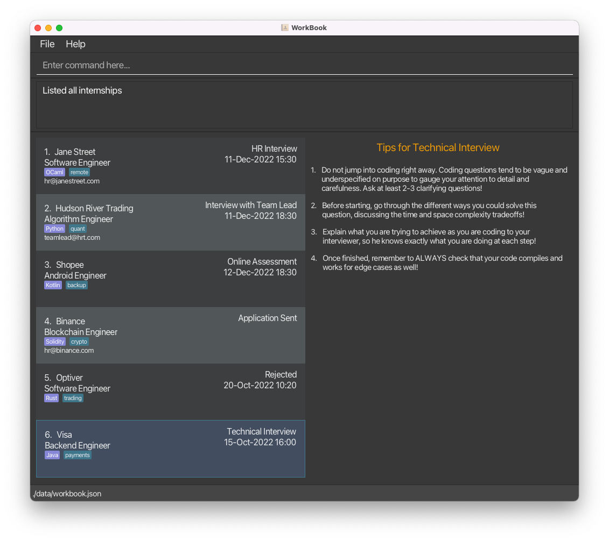
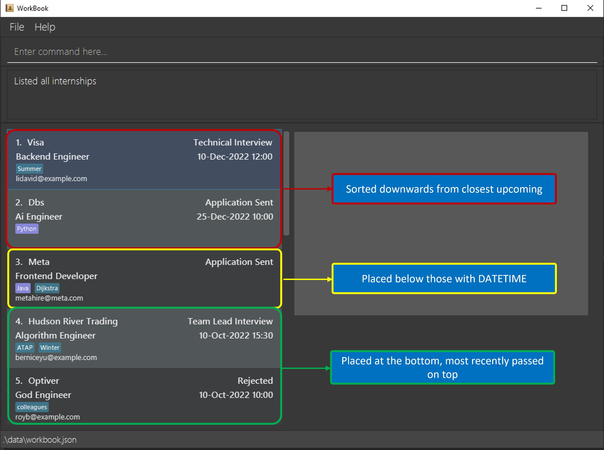

* Table of Contents
{:toc}

--------------------------------------------------------------------------------------------------------------------
## 1. Introduction to WorkBook

WorkBook is an **internship application tracker** that helps Computing students **prepare sufficiently** for their upcoming interviews to **secure** that internship.
It is optimized for fast typists and replicates a Command Line Interface (CLI) style.

--------------------------------------------------------------------------------------------------------------------

## 2. Get started

1. Ensure you have [Java 11 or above](https://www.oracle.com/sg/java/technologies/downloads/#java11) installed on your Computer.

2. Download the latest `WorkBook.jar` from [here](https://github.com/AY2223S1-CS2103T-T10-3/tp/releases/).

3. Copy the file to a folder of your choice to store data from your WorkBook.

4. Using your command terminal, navigate to the folder where you placed your WorkBook at and fire it up by inputting: `java -jar WorkBook.jar` in your terminal.   The GUI with sample data as shown below should appear in a few seconds. 
   

5. Tell WorkBook what you want by typing your command in `Enter command here...` at the top of the application.  
   Some example commands you can try:

   * `add c/Meta d/18-Oct-2022 12:00 e/hrmonkey@example.com r/Frontend` : Adds an internship application from `Meta` to the WorkBook.

   * `delete 3` : Deletes the 3rd internship shown in the current list.

   * **`help`** : Displays the help window for easy reference to the list of commands.

   * **`exit`** : Exits the app.

6. Refer to the [things to note](#3-things-to-note) below for details of each command.

--------------------------------------------------------------------------------------------------------------------

## 3. Things to note

**:information_source: Notes about the command format:** 

* Words in `UPPER_CASE` are the parameters to be supplied by the user. 
  e.g. in `add c/COMPANY`, `COMPANY` is a parameter which can be used as `add c/Meta`.

* Items in square brackets are optional. 
  e.g `c/COMPANY [t/TAG]` can be used as `c/Meta t/unattainable` or as `c/Meta`.

* Items with `…`​ after them can be used multiple times including zero times. 
  e.g. `[t/TAG]…​` can be omitted, used once: `t/unattainable`, or multiple times: `t/unattainable t/AWS`.

* Parameters can be in any order. 
  e.g. if the command specifies `c/COMPANY s/STAGE`, `s/STAGE c/COMPANY` is also acceptable.

* If a parameter is expected only once in the command, but you specified it multiple times, only the last occurrence of the parameter will be taken. 
  e.g. if you specify `r/Frontend r/Backend`, only `r/Backend` will be taken.

* Extraneous parameters for commands that do not take in parameters (such as `help`, `list`, `exit` and `clear`) will be ignored. 
  e.g. if the command specifies `help 123`, it will be interpreted as `help`.

#### Parameter-specific behaviour

* Whenever `[d/DATETIME]` is specified as a parameter, you should input it in the format `dd-MMM-yyy hh:mm` where `y` is year, `M` is month, `d` is day, `h` is hour in the 24-hour format and `m` is minutes.  
  e.g. October 2 2022 5:00pm should be input as `02-Oct-2022 17:00`.
  * Month is not case-sensitive

#### Behaviour of sorted internship applications

* The list of applications are sorted downwards from the closest upcoming application to furthest.
* Those with no `DATETIME` attached to it will be placed below those with upcoming dates.
* Applications in the past (i.e. `DATETIME` is past current time) will be placed at the bottom of the list, sorted downwards as well from the most recently passed.
* An example is shown below:

## 4. What you can do

| Action     | Command format   e.g. `Example command`                                                                                                                                                                |
|------------|-----------------------------------------------------------------------------------------------------------------------------------------------------------------------------------------------------------|
| **Add**    | `add c/COMPANY r/ROLE s/STAGE [d/DATETIME] [e/COMPANY_EMAIL] [l/LANGUAGE TAG]… [t/TAG]…​`   e.g., `add c/Bytedance r/Backend Engineer s/Online Assessment d/24-Sep-2022 15:00 t/high pay l/Javascript` |
| **Edit**   | `edit INDEX [c/COMPANY] [d/DATETIME] [e/COMPANY_EMAIL] [r/ROLE] [l/LANGUAGE TAG]… [t/TAG]…​​`  e.g.,`edit 2 c/Meta e/hr@meta.com`                                                                      |
| **Find**   | `find c/COMPANY`                                                                                                                                                                                          | r/ROLE | s/STAGE​​`  e.g.,`find c/Meta` 
| **Delete** | `delete INDEX`  e.g., `delete 3`                                                                                                                                                                       |
| **List**   | `list`                                                                                                                                                                                                    |
| **Undo**   | `undo`                                                                                                                                                                                                    |
| **Redo**   | `redo`                                                                                                                                                                                                    |
| **Clear**  | `clear`                                                                                                                                                                                                   |
| **Help**   | `help`                                                                                                                                                                                                    |
| **Exit**   | `exit`                                                                                                                                                                                                    |

**:information_source: Note:** 

* Commands without examples are considered trivial and can be executed by inputting the command without additional parameters.
* Commands are **case-sensitive**!

### 4.1. Adding an internship application: `add`

Adds an internship application to WorkBook.

Format: `add c/COMPANY r/ROLE s/STAGE [d/DATETIME] [e/COMPANY_EMAIL] [l/LANGUAGE TAG] [t/TAG]…​`

* Adds an internship application to the list in [sorted order](#3-things-to-note).
* Date can represent:
  * The date it happened
  * The deadline of the corresponding `Stage`

Examples:
* `add c/Meta r/Frontend Engineer s/Application Sent d/29-Oct-2022 12:00 e/hrmonkey@example.com`
* `add c/Bytedance r/Backend Engineer s/Online Assessment d/24-Sep-2022 15:00 t/high pay l/Java l/Python`

### 4.2. Editing an internship application : `edit`

Edits an existing internship application in the WorkBook.

Format: `edit INDEX [c/COMPANY] [r/ROLE] [s/STAGE] [d/DATETIME] [e/COMPANY_EMAIL] [l/LANGUAGE TAG] [t/TAG]…​`

* Edits the internship at the specified `INDEX`. The index refers to the index number shown in the displayed internships list. The index **must be a positive integer** 1, 2, 3, …​
* At least one of the optional fields must be provided.
* Existing values will be updated to the input values.
* When editing tags, the existing tags of the internship will be removed i.e adding of tags is not cumulative.
* You can remove all the internship’s tags by typing `t/` without
    specifying any tags after it.

Examples:
* `edit 1 s/Behavioural Interview e/hr@meta.com` Edits the stage and email address of the first internship to be `Behavioural Interview` and `hr@meta.com` respectively.
* `edit 2 l/golang t/` Adds `golang` as the only language tag for the second internship and clears all existing tags.

### 4.3. Listing all existing internship applications : `list`

Lists all internship applications in the Workbook.

Format: `list`

### 4.4. Finds internships by company, stage or role name: `find`

Finds internships whose company, role or stage names contain any of the respective keywords.

Format: `find c/COMPANY | r/ROLE | s/STAGE`

* Displays a list of internships that match all the keywords.
* Case does not matter e.g. `meta` will match `Meta`.
* Only full words will be matched e.g. `met` will not match `Meta`.
* Order of the keywords does not matter e.g. `Jane Street` will match `Street Jane`.
* Exactly one attribute can be searched for either Company, Role or Stage.

Examples:
* `find r/Engineer` returns `Software Engineer` and `Backend Engineer`.
* `find s/Interview` returns `Technical Interview` and `Behavioural Interview`.

### 4.5. Deleting an internship application : `delete`

Deletes the specified internship application from WorkBook.

Format: `delete INDEX`

* Deletes the internship application at the specified `INDEX`.
* The index refers to the index number shown in the displayed internship application list.
* The index **must be a positive integer** 1, 2, 3, …​

Examples:
* `list` followed by `delete 2` deletes the 2nd internship application in WorkBook.
* `find Meta` followed by `delete 1` deletes the 1st internship application within the results of the `find` command.

### 4.6. Clearing all existing internship applications : `clear`

Clears all internship applications in the Workbook.

Format: `clear`

Example:
* `clear` removes all internship applications in the workbook.

### 4.7. Undoing previous command: `undo`

Restores the work book to the state before the previous <em>undoable</em> command was executed

Format: `undo`

Undoable commands: commands that modify the work book's content (`add`, `delete`, `edit` and `clear`)

Examples:
* `delete 1`

    `list`

    `undo` (reverses the `delete 1` command)

* `find google`

  `list`

  `undo` 

    The `undo` command fails as there are no undoable commands executed previously.

    
* `delete 1`
    
    `clear`

    `undo` (reverses the `clear` command)

    `undo` (reverses the `delete 1` command )

### 4.8. Redoing previous command: `redo`

Reverses the most recent `undo` command.

Format: `redo`

Examples:
* `delete 1`

  `undo` (reverses the `delete 1` command)

  `redo` (reapplies the `delete 1` command)

* `delete 1`

  `redo`

  The `redo` command fails as there are no `undo` commands executed previously.

* `delete 1`

  `clear`

  `undo`(reverses the `clear` command)

  `undo`(reverses the `delete 1` command)

  `redo`(reapplies the `delete 1` command)

  `redo`(reapplies the `clear` command)

### 4.9. Viewing help : `help`

Shows a summary of the commands as well as a link to this User Guide.

Format: `help`

Example:
* `help`

### 4.10. Exiting the program : `exit`

Exits the program.

Format: `exit`

### 4.11. Daily Tips `[coming soon]`

_Details coming soon ..._

--------------------------------------------------------------------------------------------------------------------

## 5. Managing your data

### 5.1. Saving

Conveniently, any inputted command that changes any part of your internship application is **automatically saved**!
Hence, you need not worry about pressing `ctrl` and `s` everytime you update your list of internship applications.

### 5.2. Editing

All your internship applications are saved in a JSON file under the `data` subfolder. 
You are free to update any internship application directly by editing that JSON file.

**:information_source: JSON?:** 
* JSON stands for JavaScript Object Notation, learn how to edit the file [here](https://www.softwaretestinghelp.com/how-to-open-a-json-file/)!

:exclamation: **Caution:**
If your changes to the data file makes its format invalid, WorkBook will discard all data and start with an empty data file at the next run.

--------------------------------------------------------------------------------------------------------------------

## 6. Frequently asked questions

**Q**: How do I transfer my data to another Computer? 
**A**: [Install](#2-get-started) the app in the other computer, copy and override the JSON file in the new `data` subfolder, and you are done!

**Q**: How do I change the theme of WorkBook? 
**A**: It is not possible as of now, but will be coming soon!

--------------------------------------------------------------------------------------------------------------------

